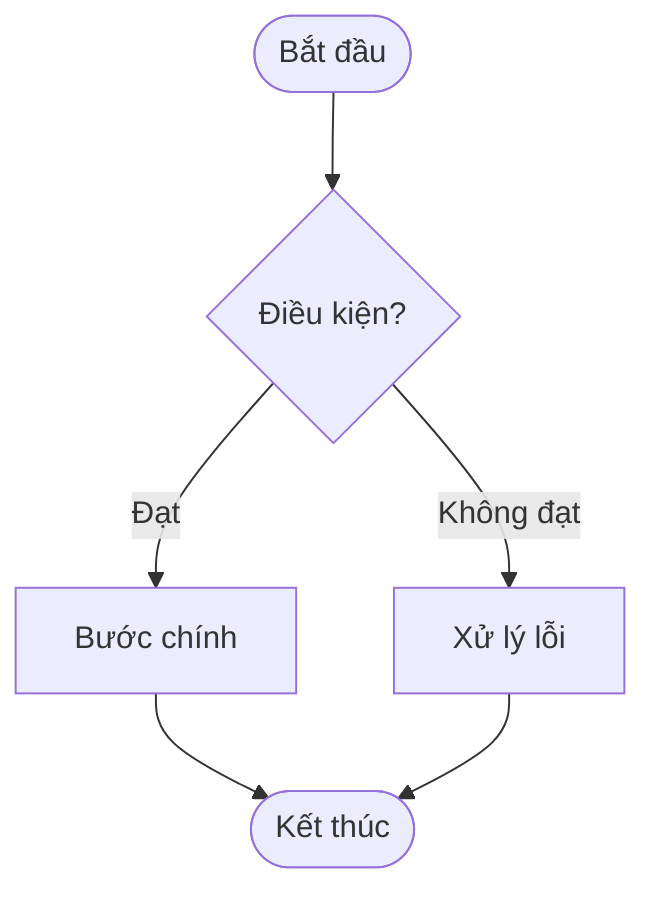

# Flow: <tên>

```mermaid
flowchart TD
    A([Bắt đầu]) --> B{Điều kiện?}
    B -- Đạt --> C[Bước chính]
    B -- Không đạt --> E[Xử lý lỗi]
    C --> D([Kết thúc])
    E --> D
```

## Chú thích
- Mỗi nhánh lỗi trong sơ đồ phải có Given/When/Then tương ứng trong requirement.
- Epic khác bị chạm tới: ...
