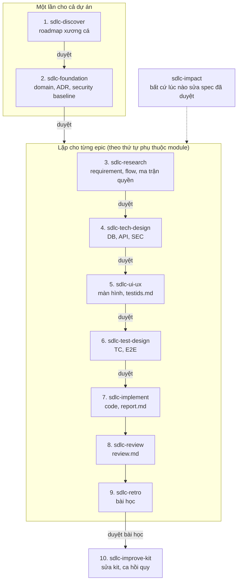

# Min-SDLC

Bộ kit biến các giai đoạn SDLC thành **skill + hook + script** cho Claude Code.
Nguyên tắc: phần cần phán đoán thì để skill; phần phải được bảo đảm thì để hook/script.

> Đang xây dựng. Xem [HANDOFF.md](HANDOFF.md) để biết đã làm gì, đang chờ gì, làm tiếp từ đâu.

## Cài đặt trên máy mới

```bash
git clone --recurse-submodules https://github.com/bvminh-dev/Min-SDLC.git
cd Min-SDLC
# nếu quên --recurse-submodules:
git submodule update --init
node .claude/sdlc/scripts/check-adapter.mjs   # phải in "OK: adapter spec-kit@v1.1.0 khớp."
```

Yêu cầu: Node.js 20 trở lên (các script và hook là `.mjs`, không cần cài thêm gói), Git, Claude Code.
Hook đọc biến `CLAUDE_PROJECT_DIR` do Claude Code đặt. Nếu hook không chạy ngay sau khi mở dự án, mở `/hooks` một lần để nạp lại cấu hình.

## Thứ tự chạy skill

Gọi skill bằng tên trong Claude Code (ví dụ `/sdlc-foundation`). **Giữa hai phase luôn có một cổng duyệt của người**: Claude chỉ ghi `draft`, người đọc rồi đổi `status: approved` trong editor (hook chặn Claude tự duyệt). Phase sau chỉ chạy khi đầu ra phase trước đã duyệt.



| # | Skill | Chạy khi | Cần có trước | Ghi ra |
|---|---|---|---|---|
| 1 | `sdlc-discover` | bắt đầu dự án mới | ý tưởng sản phẩm | `spec/roadmap.md` |
| 2 | `sdlc-foundation` | roadmap đã duyệt, **một lần** (và khi có quyết định nền mới) | roadmap | `spec/domain/`, `architecture.md`, `security-baseline.md`, `constitution.md` |
| 3 | `sdlc-research` | bắt đầu một epic | nền đã duyệt | `spec/epics/<EPIC>/requirements/`, `flows/`, `spec/permissions-matrix.md` |
| 4 | `sdlc-tech-design` | requirement của epic đã duyệt | requirement | `spec/epics/<EPIC>/design/` (DB, API, SEC) |
| 5 | `sdlc-ui-ux` | thiết kế kỹ thuật đã duyệt | requirement, design | `spec/epics/<EPIC>/ui/`, `spec/testids.md` |
| 6 | `sdlc-test-design` | màn hình đã duyệt (cần `testids.md`) | requirement, design, ui | `spec/epics/<EPIC>/tests/` (TC, E2E) |
| 7 | `sdlc-implement` | test đã duyệt, đã dựng khung dự án theo ADR-002 | cả bốn loại tài liệu trên | code, `spec/epics/<EPIC>/report.md` |
| 8 | `sdlc-review` | epic đã có code và `report.md` | mã nguồn, report | `spec/epics/<EPIC>/review.md` |
| 9 | `sdlc-retro` | epic đã qua review | report, review, `spec/changes/` | `spec/lessons/<ngày>-<EPIC>.md` |
| 10 | `sdlc-improve-kit` | bài học đã `approved` | file bài học | thay đổi trong `.claude/`, `improvements.md` |
| - | `sdlc-impact` | **bất cứ lúc nào** sửa requirement, flow, quyền hay nền đã duyệt; hoặc khi research chạm epic khác | ID bị đổi | `spec/changes/<ID>.md` |

Quy tắc đi kèm:
- **Thứ tự epic**: theo cột *Phụ thuộc* ở `spec/architecture.md`: `PRJ` trước, rồi `AUTH`, rồi các epic chỉ phụ thuộc epic đã xong. Epic nào phụ thuộc epic chưa có spec thì để `[OPEN]`, đừng đoán.
- **Spec sai thì quay lại, không vá ở phase sau**: lỗi thấy ở phase 4-8 mà do requirement hay nền thì chạy `sdlc-impact`, sửa ở phase gốc, rồi chạy lại các phase sau.
- **Mỗi phase tự kiểm bằng script** (hook cũng tự chạy khi sửa file và khi kết thúc phiên); chi tiết ở `SKILL.md` của skill đó.
- Skill 2-6 và `sdlc-impact` đã được kiểm thử có đối chứng (xem `evals/RESULTS.md` của từng skill). `sdlc-discover` chưa chạy lần nào. Skill 7-10 mới có script và test đơn vị, **chưa chạy trên mã thật** (xem [HANDOFF.md](HANDOFF.md)).

## Cấu trúc

```
.claude/
  settings.json            hook: chặn sửa spec đã duyệt, kiểm hình thức, chặn kết thúc khi spec lỗi
  sdlc/
    contract.md            hợp đồng đầu ra mỗi phase (không đổi khi đổi framework)
    adapter/               active.md (framework đang dùng) + mapping.<framework>.md; cột Skill nối phase với skill,
                           check-adapter kiểm hai chiều và kiểm ghim cả submodule evon
    framework/spec-kit/    git submodule: GitHub Spec Kit, ghim v1.1.0
    hooks/                 guard-approved, check-spec-file, stop-check-spec
    scripts/               check-adapter.mjs, selftest.mjs (chạy mọi kiểm tự động của kit)
    improvements.md        nhật ký cải tiến kit (do sdlc-improve-kit ghi)
  skills/                  theo thứ tự phase trong contract.md
    sdlc-discover/         khảo sát sản phẩm, roadmap xương cá
    sdlc-foundation/       nền dự án: vai trò, entity, event, kiến trúc, bảo mật, nguyên tắc
    sdlc-research/         requirement, flow, ma trận quyền cho một epic
    sdlc-impact/           phân tích tác động theo ID khi spec đổi
    sdlc-tech-design/      DB, API, SEC (threat model), ràng buộc kiến trúc theo epic
    sdlc-ui-ux/            màn hình + testids.md; luật giao diện lấy từ git submodule evondevKit
                           (skill evon:ui-ux, MIT, ghim v0.3.18) ở references/evon-ui-ux
    sdlc-test-design/      test case (TC) và E2E, phủ kịch bản và mối đe dọa, dùng testid
    sdlc-implement/        task theo phụ thuộc, code + test, báo cáo truy vết (report.md)
    sdlc-review/           đối chiếu code với spec, quyền, baseline; bằng chứng file:dòng
    sdlc-retro/            bài học từ epic đã xong, chờ người duyệt
    sdlc-improve-kit/      áp dụng bài học đã duyệt vào kit, thêm ca hồi quy
```

Mỗi skill có `SKILL.md` (mỏng), `templates/`, `scripts/` và `evals/` (ca kiểm thử kèm kết quả).

## Cách hoạt động

- **Spec là nguồn sự thật chung**, ghi vào `spec/` của dự án dùng kit. Mỗi tài liệu có ID theo thời gian
  (`CHK-REQ-20261005-143012123`) do script sinh, nên nhiều người làm song song không đụng nhau.
- **Adapter**: skill không gọi thẳng framework ngoài. Đổi framework thì thêm submodule + viết mapping mới
  (xem `.claude/sdlc/adapter/active.md`), không sửa skill.
- **Duyệt là việc của người**: hook chặn Claude sửa file `status: approved` và chặn việc tự đổi sang approved.

## Kiểm tra nhanh

```bash
node .claude/sdlc/scripts/selftest.mjs     # chạy check-adapter và toàn bộ test của các script; phải in "N/N qua"
node .claude/sdlc/scripts/check-adapter.mjs
ls .claude/skills/sdlc-ui-ux/references/evon-ui-ux/skills/ui-ux/SKILL.md   # phải tồn tại (submodule evon đã nạp)
node .claude/skills/sdlc-research/scripts/check-spec.mjs .claude/skills/sdlc-research/evals/checkout/fixture/spec
```
