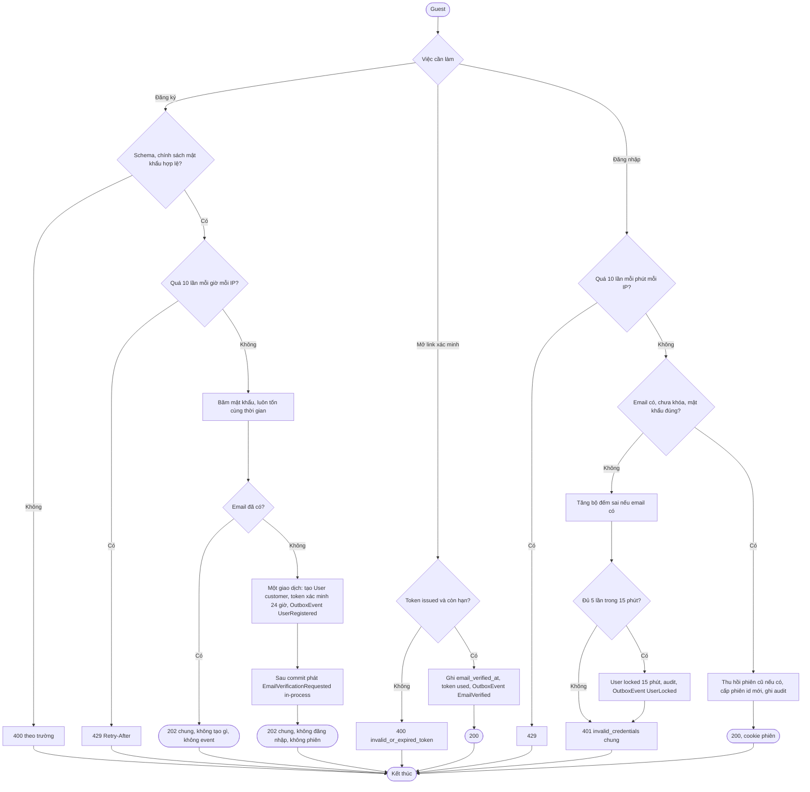
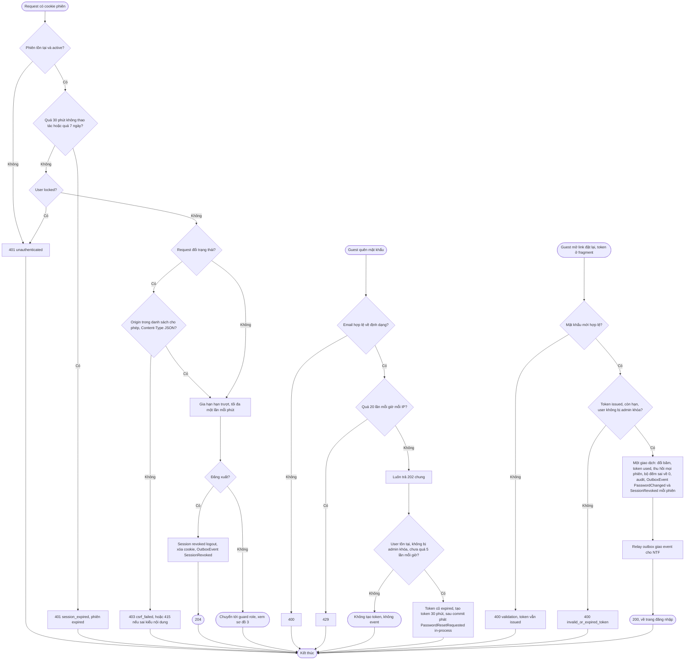
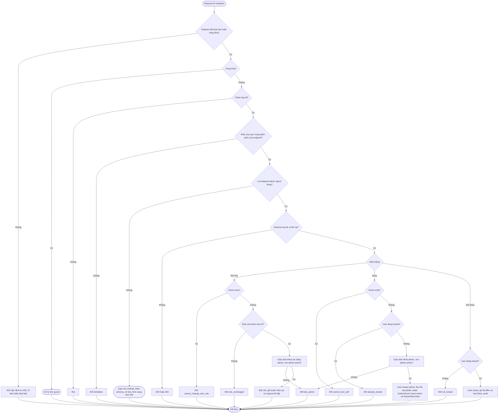

# Flow: Định danh, phiên, khôi phục mật khẩu và phân quyền (AUTH)

## 1. Đăng ký, xác minh email, đăng nhập

Khách đã đăng nhập chưa xác minh bấm gửi lại: kiểm 401 (không phiên), 403 (`Origin` lạ), 409 `already_verified`, 429 (cách nhau dưới 60 giây hoặc quá 5 lần mỗi giờ); đạt thì token cũ `expired`, token mới 24 giờ, sau commit phát EmailVerificationRequested (in-process, best-effort), trả 202.

## 2. Phiên, đăng xuất và đặt lại mật khẩu

## 3. Kiểm quyền và quản trị người dùng

## Chú thích
- Mỗi nhánh lỗi có Given/When/Then ở requirement: đăng ký AUTH-REQ-20261006-095515620, xác minh AUTH-REQ-20261006-095515665, gửi lại AUTH-REQ-20261006-095515702, đăng nhập AUTH-REQ-20261006-095515738, đăng xuất AUTH-REQ-20261006-095515774, phiên AUTH-REQ-20261006-095515808, quên mật khẩu AUTH-REQ-20261006-095515843, đặt lại AUTH-REQ-20261006-095515881, kiểm quyền AUTH-REQ-20261006-095515918, người dùng và đổi role AUTH-REQ-20261006-095515956, khóa AUTH-REQ-20261006-095515994.
- Epic khác bị chạm: NTF (gửi email xác minh, đặt lại, báo khóa, báo đổi mật khẩu; gọi `getUserContact`, `listActiveUserIdsByRole` của AUTH), CHK (chặn đặt hàng khi chưa xác minh, đọc `email_verified` từ session context), USR (đổi mật khẩu đi qua `changePassword`: thu hồi mọi phiên, phiên của request `replaced`, cấp phiên mới; `updateProfile`), ORD (đã có spec, dùng guard), mọi epic khác (guard và ma trận). Giới hạn tần suất, audit, log là phần dùng chung của platform (ADR-012), không khai ở cột Phụ thuộc.
- Quyết định nền đã áp dụng (2026-10-06): đăng ký không lộ email tồn tại nên trả 202 chung và không tự đăng nhập (SB-02, S-06); chống CSRF bằng `Origin` cộng SameSite=Lax, không có CSRF token (ADR-016); event đi outbox trừ hai event mang token thô (ADR-011, K-14); admin đầu tiên bằng lệnh seed (R-03, SB-29); UserUnlocked, UserRoleChanged ở backlog (V-16).
