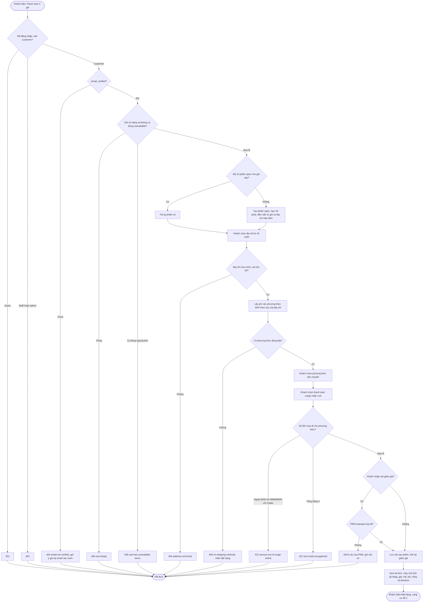
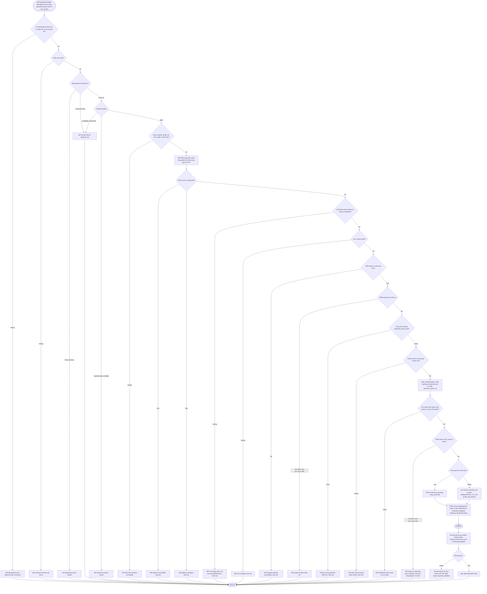

# Flow: Checkout từ giỏ tới đơn hàng (CHK)

## 1. Mở phiên, chọn thông tin và xem lại (customer)



## 2. Đặt hàng: một giao dịch theo ADR-009



## 3. Sau khi đặt: hậu quả ở các epic khác (tác nhân hệ thống)

```mermaid
flowchart TD
    A([Giao dịch đặt hàng cam kết, event nằm trong outbox]) --> B[ORD phát OrderCreated]
    B --> C[PAY nhận, tạo Payment pending]
    B --> D[NTF nhận, báo đơn đã tạo]
    A --> E[CHK phát CheckoutCompleted]
    E --> F[CRT nhận, giỏ sang converted]
    A --> G{COD?}
    G -- Có --> H[ORD phát OrderConfirmed]
    H --> I[INV chốt hàng, trừ kho]
    H --> I2[PRM tiêu thụ lượt coupon reserved sang consumed]
    H --> J[SHP tạo vận đơn pending]
    G -- Không --> K[Khách thanh toán trong 15 phút]
    K --> L{Thanh toán thành công?}
    L -- Có --> M[PAY phát PaymentSucceeded, ORD sang paid, INV chốt, PRM tiêu thụ lượt, SHP tạo vận đơn]
    L -- Không, quá hạn --> N[INV job hết hạn, ORD sang expired, PAY và PRM nhả]
    L -- Thanh toán đến sau hạn --> N2[Một giao dịch thắng: INV phát StockCommitFailed, PAY hoàn tiền late_payment; ORD no-op với đơn đã đóng, còn đơn paid thì tự hủy do hệ thống (paid sang cancelled, stock_commit_failed, PAY không hoàn lần hai; M-04)]
    L -- Hết lượt thử --> O[ORD hủy đơn khi PaymentFailed is_final, tức attempt_no đạt PAY_MAX_ATTEMPTS mặc định 3; INV nhả hàng]
    N --> P[Giỏ đã converted: khách thêm lại hàng, đặt đơn mới]
    O --> P
    I --> Z([Kết thúc])
    I2 --> Z
    N2 --> Z
    J --> Z
    M --> Z
    P --> Z
```

## Chú thích
- Mỗi nhánh lỗi ở sơ đồ 1 và 2 có Given/When/Then ở requirement tương ứng: địa chỉ ở CHK-REQ-20261006-105051095, vận chuyển ở CHK-REQ-20261006-105051242, thanh toán và giới hạn đơn mở ở CHK-REQ-20261006-105051386, mã giảm giá ở CHK-REQ-20261006-105051536, xem lại ở CHK-REQ-20261006-105051681, kiểm giá ở CHK-REQ-20261006-105051825, kiểm tồn ở CHK-REQ-20261006-105051977, giữ hàng ở CHK-REQ-20261006-105052127, tạo đơn ở CHK-REQ-20261006-105052272, hết hạn và hủy phiên ở CHK-REQ-20261006-105052414.
- Thứ tự giữ hàng và tạo đơn theo ADR-009: tạo Order `pending` **trước**, giữ hàng **sau**, cùng giao dịch. Mọi lỗi ở giao dịch hoàn tác toàn bộ nên không có đơn dở; không có bước bù trừ.
- Hết hạn thanh toán online do INV giữ đồng hồ (ADR-009, K-01): CHK chỉ tính `expires_at` một lần (`RESERVATION_TTL`) và truyền cùng giá trị cho INV và ORD, không có bộ đếm giờ cho đơn. Mọi event đi qua outbox (ADR-011); CHK không nhận event nào. `Idempotency-Key` (ADR-017) chặn gửi lại; AuditLog ghi cùng giao dịch (SB-19).
- Epic khác bị chạm tới: CRT (dòng hàng, `cart_version`, CheckoutCompleted), USR (địa chỉ), SHP (phương thức, phí, tạo vận đơn sau OrderPaid/OrderConfirmed), PRM (`evaluate`, `reserve`, nhả lượt), INV (`reserve`, chốt, nhả, hết hạn), ORD (tạo đơn, xác nhận COD, hết hạn, hủy), PAY (tạo Payment, thanh toán), NTF (thông báo), AUTH (guard, `email_verified`).
