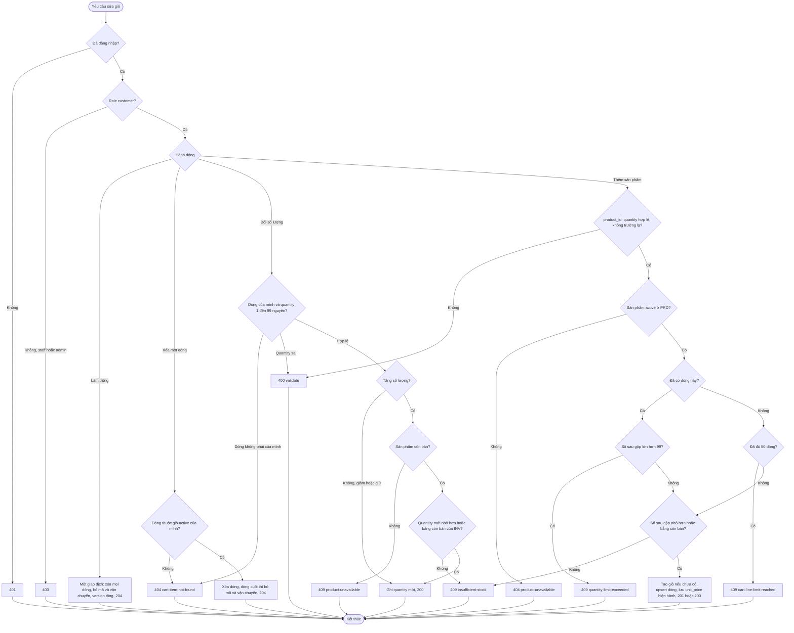
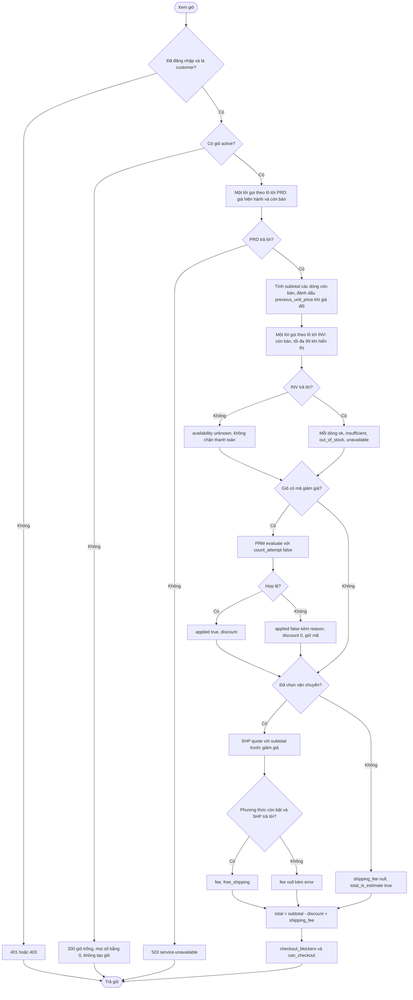
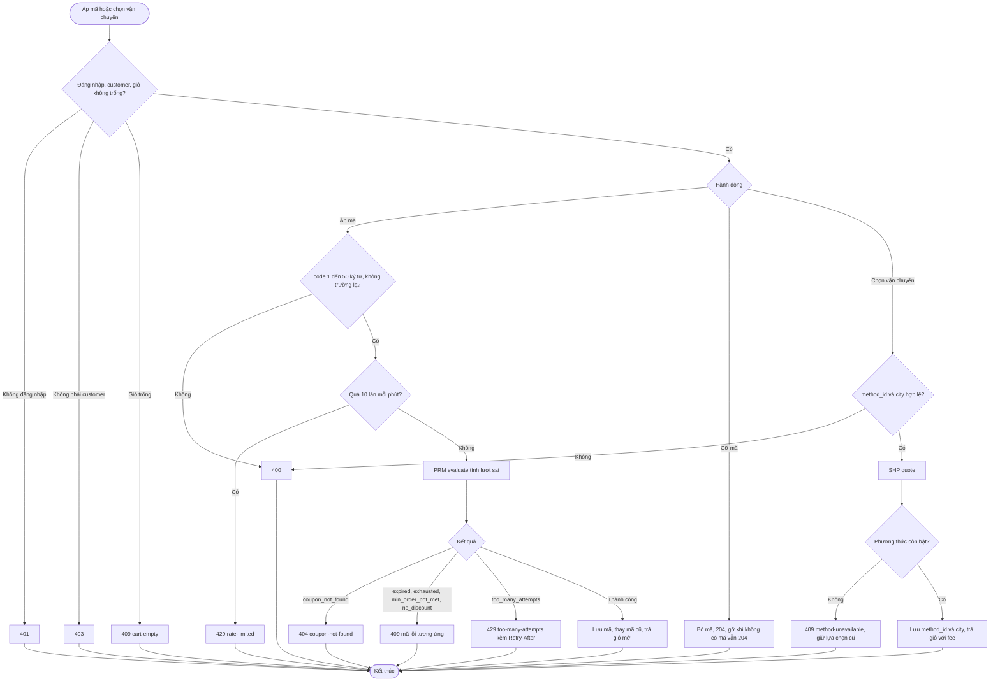
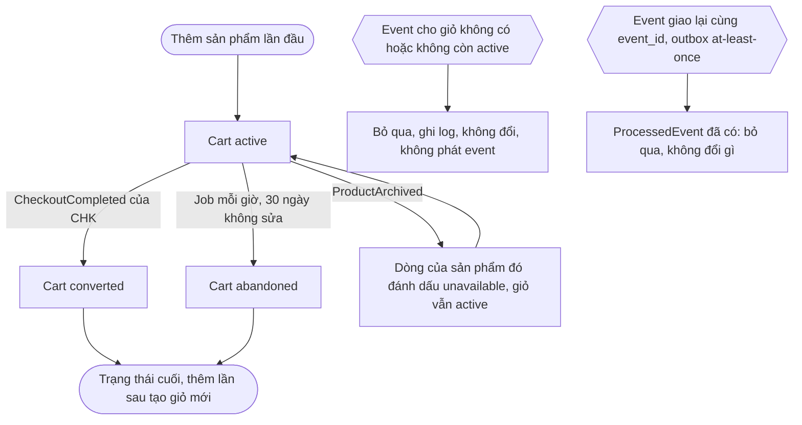

# Flow: Giỏ hàng (CRT)

## 1. Sửa giỏ: thêm, đổi số lượng, xóa, làm trống

## 2. Xem giỏ: tạm tính, mã, vận chuyển, tổng, kiểm tồn

## 3. Áp mã và chọn vận chuyển

## 4. Vòng đời giỏ theo event và job (tác nhân `system`, event qua outbox ADR-011, CheckoutCompleted cả vnpay và COD)

## Chú thích
- Mỗi nhánh lỗi ở sơ đồ 1 có Given/When/Then ở CRT-REQ-20261006-103226376 (thêm), CRT-REQ-20261006-103226406 (đổi số lượng), CRT-REQ-20261006-103226434 (xóa), CRT-REQ-20261006-103226460 (làm trống). Sơ đồ 2 ứng với CRT-REQ-20261006-103226486, CRT-REQ-20261006-103226562 và CRT-REQ-20261006-103226588; sơ đồ 3 ứng với CRT-REQ-20261006-103226511 và CRT-REQ-20261006-103226537; sơ đồ 4 ứng với CRT-REQ-20261006-103226614.
- Mọi số tiền chỉ do máy chủ tính; client chỉ gửi `product_id`, `quantity`, `code`, `method_id`, `city`.
- Epic khác bị chạm tới: PRD (giá hiện hành, ProductArchived), INV (`getAvailability`, kiểm mềm, không giữ hàng), PRM (`evaluate`, không `reserve`), SHP (`quote`), CHK (đã có spec: đọc giỏ đã định giá qua `snapshotForCheckout` và `lockForCheckout`, giữ hàng và mã thật, phát CheckoutCompleted cho cả COD), `platform` (guard phiên và role, giới hạn tần suất theo SB-14, CSRF, outbox, job nền, ADR-011 đến ADR-014). PAY chưa liên quan CRT; tổng 0 đồng còn ghi ở questions.md.
- Kiểm lại mã ở mỗi lần xem dùng `count_attempt` = false nên không tăng bộ đếm thử sai của PRM (hợp đồng đã vào bảng Giao diện module, PRM-REQ-20261006-101036327 BR11; M-02, R-29).
- Tiền chỉ tính ở server mỗi lần xem (K-07): Cart chỉ giữ mã, phương thức vận chuyển, thành phố; nguồn sự thật của tiền là Order và Payment.
