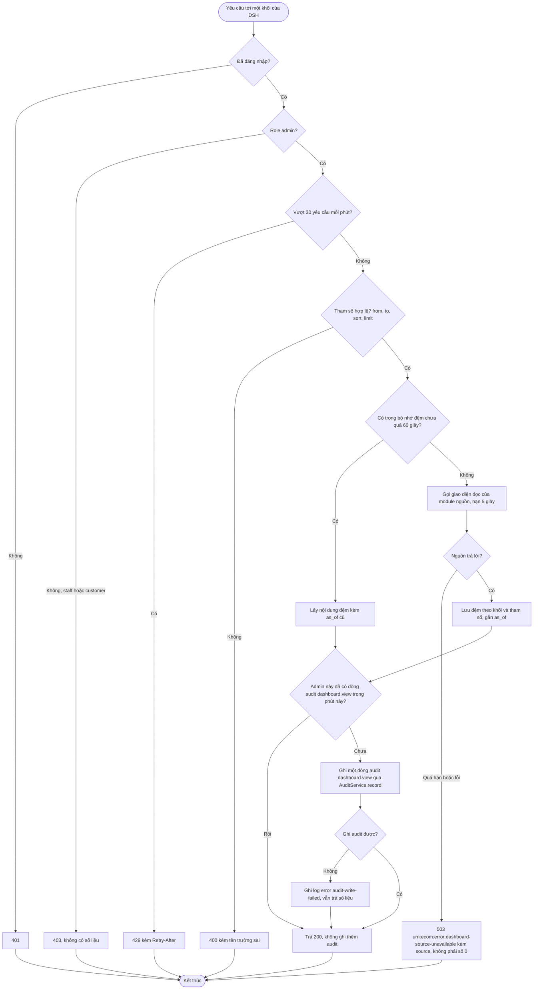
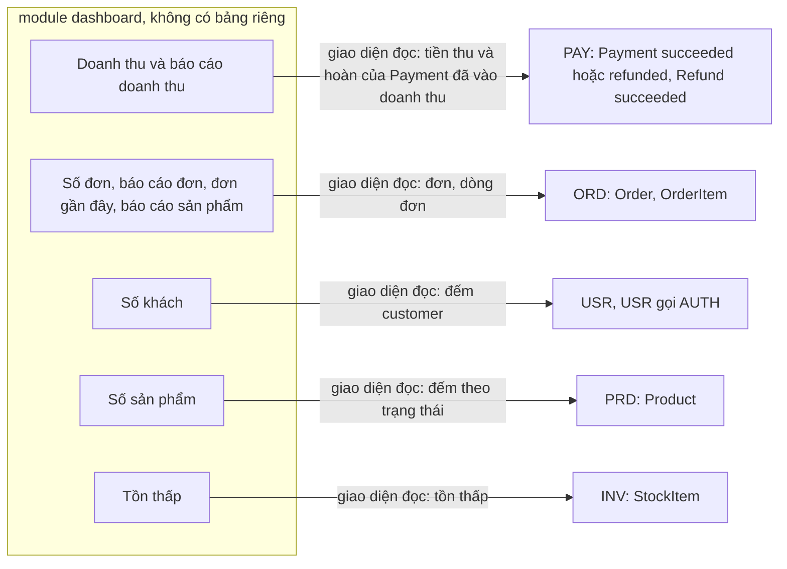

# Flow: Đọc một khối của dashboard và báo cáo (DSH)

## 1. Một yêu cầu tới một khối (mọi endpoint của DSH)

## 2. Nguồn dữ liệu của từng khối (không đọc xuyên bảng)

## Chú thích
- Mỗi nhánh lỗi có Given/When/Then trong DSH-REQ-20261006-105126549 (401, 403, 429, 503, đệm, audit) và trong requirement của khối (400 khoảng ngày sai, 400 tham số sai, 503 theo nguồn).
- Epic khác bị chạm: PAY, ORD, PRD, INV, USR (giao diện đọc theo ADR-020 và bảng "Giao diện module"; chữ ký chốt ở tech-design của họ, ghi ở questions.md), AUTH (phiên, role, qua guard của platform), PRJ (AuditLog, giới hạn tần suất bậc D, mã lỗi URN).
- Audit gộp một dòng mỗi admin mỗi phút (K-16, SB-19): một lần mở dashboard gọi sáu khối chỉ ghi một dòng; yêu cầu bị từ chối hoặc 503 không ghi.
- Thứ tự chỉ trong một yêu cầu; sáu khối của trang dashboard được gọi song song và độc lập (DSH-REQ-20261006-105126549 BR2).
