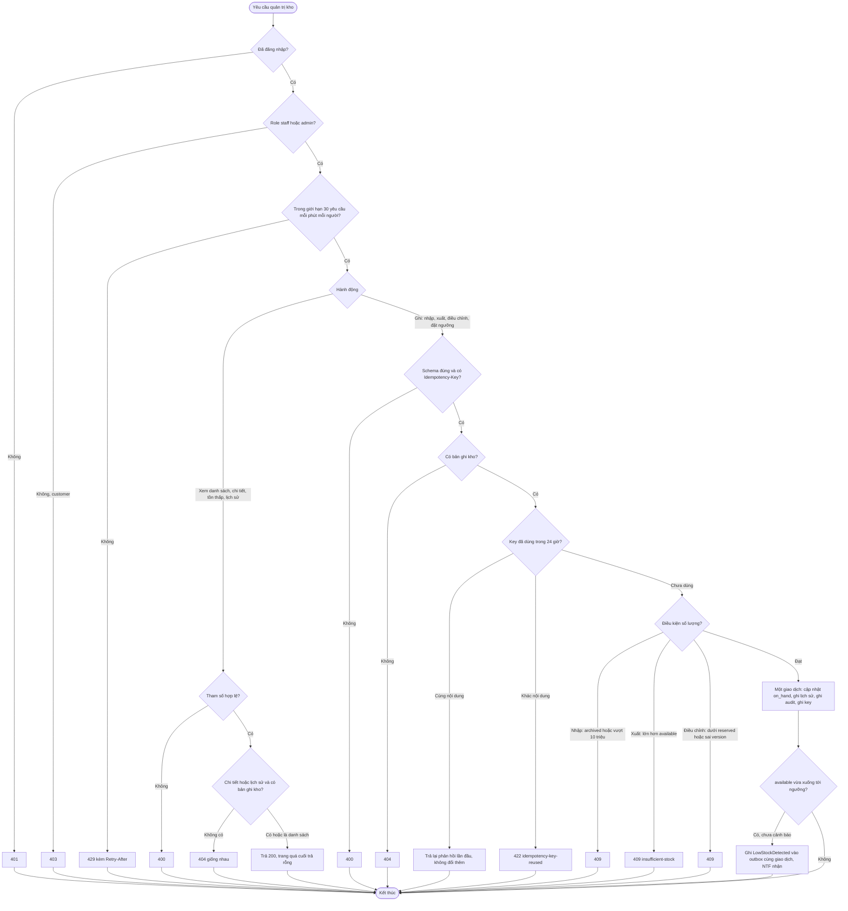
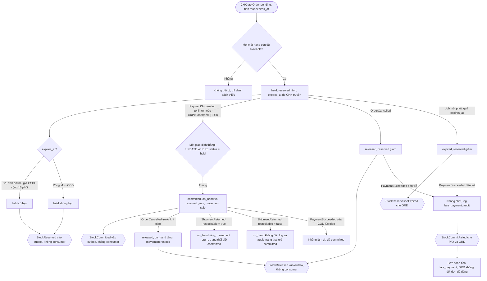
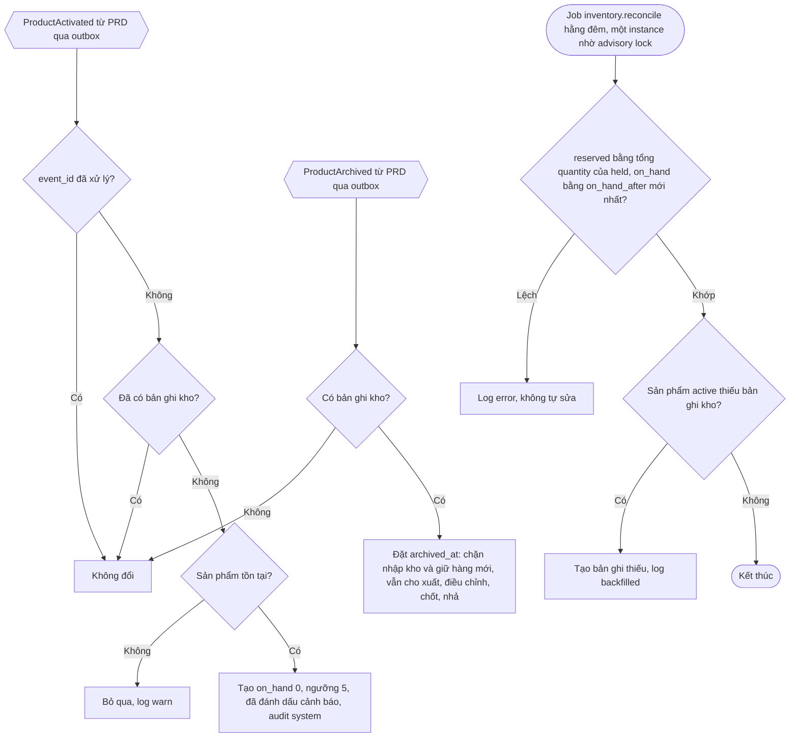
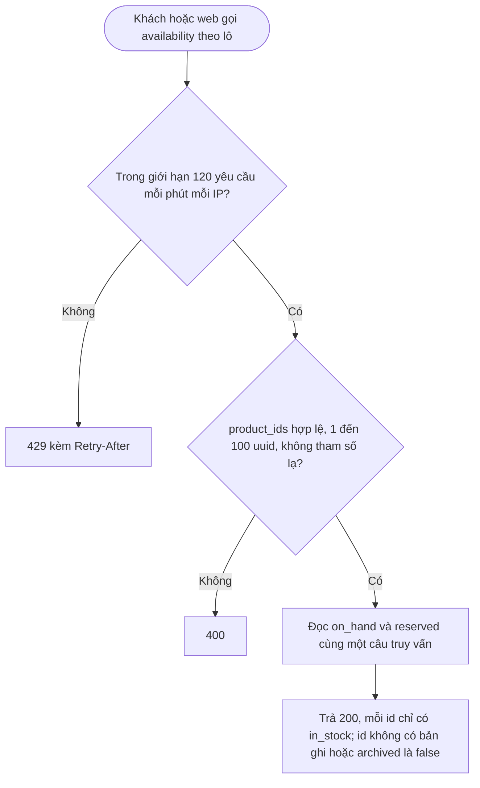

# Flow: Tồn kho, giữ hàng và chống bán vượt (INV)

## 1. Thao tác của staff và admin (xem, nhập, xuất, điều chỉnh, ngưỡng, lịch sử)

## 2. Vòng đời giữ hàng (tác nhân hệ thống: Checkout, Payment, Order, Shipping, job)

## 3. Vòng đời bản ghi kho và đối soát

## 4. Xem còn hàng công khai (không lộ số tồn)

## Chú thích
- Mỗi nhánh lỗi ở sơ đồ 1 có Given/When/Then ở requirement: xem INV-REQ-20261006-101122435; nhập INV-REQ-20261006-101122463; xuất INV-REQ-20261006-101122487; điều chỉnh INV-REQ-20261006-101122512; ngưỡng và tồn thấp INV-REQ-20261006-101122611; lịch sử INV-REQ-20261006-101122637.
- Sơ đồ 2: giữ hàng INV-REQ-20261006-101122538; chốt, nhả, hoàn, thu tiền trễ INV-REQ-20261006-101122562; hết hạn INV-REQ-20261006-101122587; bất biến và đối soát INV-REQ-20261006-101122661. Sơ đồ 3: INV-REQ-20261006-101122685. Sơ đồ 4: INV-REQ-20261006-120036236.
- Quy tắc áp từ nền: INV chạy đồng hồ hạn giữ hàng duy nhất, hạn do CHK truyền (K-01, ADR-009); một giao dịch thắng giữa thanh toán, hết hạn, hủy (K-02); event đi qua outbox, consumer chống trùng theo `event_id` (ADR-011); không `reservation_id`, khóa theo `order_id` (K-05); consumer chỉ khai khi có handler (K-09).
- Epic khác bị chạm tới: PRD (ProductActivated, ProductArchived; tên và sku hiển thị), CHK (gọi `reserve`; INV không nhận CheckoutExpired vì phiên hết hạn chưa có đơn), CRT (gọi `getAvailability`), ORD (OrderConfirmed, OrderCancelled; nhận StockReservationExpired, StockCommitFailed), PAY (PaymentSucceeded; nhận StockCommitFailed để hoàn tiền), SHP (ShipmentReturned), NTF (LowStockDetected), DSH (gọi `getLowStockSummary`), AUTH và PRJ (phiên, role, audit, job, outbox, idempotency).
- Còn lại cần người: cách lấy tên người thao tác cho lịch sử kho, dòng INV gọi PRD ở bảng giao diện module (xem questions.md).
