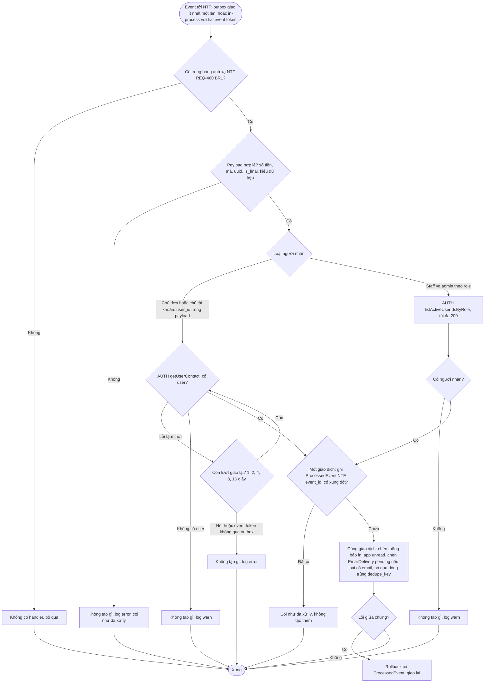
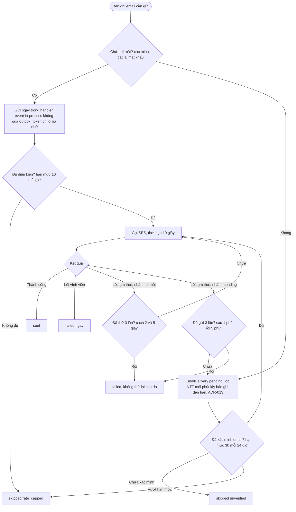
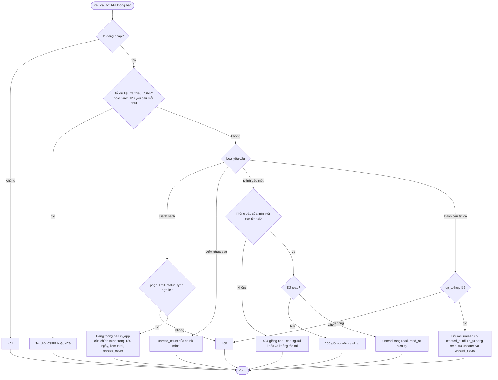

# Flow: Từ event tới thông báo, email và việc đọc (NTF)

## 1. Nhận event và tạo thông báo trong ứng dụng

## 2. Gửi email

## 3. Xem, đọc và lịch sử thông báo

## Chú thích
- Sơ đồ 1 ứng với NTF-REQ-20261006-103208460 (đường ống), và nội dung từng loại ở NTF-REQ-20261006-103208641 (đơn tạo, xác nhận), NTF-REQ-20261006-103208725 (thanh toán thành công), NTF-REQ-20261006-103208812 (đang giao, giao thất bại, đơn hoàn về do OrderReturned, M-03), NTF-REQ-20261006-103208902 (đã giao), NTF-REQ-20261006-103208992 (thanh toán thất bại, hủy, hoàn tiền), NTF-REQ-20261006-103209078 (tài khoản), NTF-REQ-20261006-103209168 (cảnh báo vận hành). Mỗi nhánh lỗi (payload sai, không có người nhận, AUTH lỗi tạm thời, trùng) có Given/When/Then ở requirement tương ứng.
- Sơ đồ 2 ứng với NTF-REQ-20261006-103208551; nhánh "chứa bí mật" là NTF-REQ-20261006-103209078 BR3 (token không bao giờ lưu hay log).
- Sơ đồ 3 ứng với NTF-REQ-20261006-103209256 (đánh dấu đã đọc, đếm) và NTF-REQ-20261006-103209345 (lịch sử).
- Epic khác bị chạm: ORD, PAY, SHP, INV, AUTH (producer event); NTF phụ thuộc trực tiếp chỉ AUTH (`getUserContact`, `listActiveUserIdsByRole`, bảng Giao diện module); guard, CSRF, giới hạn tần suất, `problem+json`, outbox, job nền là platform (PRJ, ADR-012), cấu hình SES ở PRJ.
- Chỗ còn lưu ý sau lần sửa nền 2026-10-06: payload đã mang `event_id`, `user_id`, `order_code` nên không còn bảng chiếu; email chứa token không thể thử lại bằng hàng đợi vì không được lưu bí mật và event token không qua outbox (K-14), nên mất thì khách gửi lại ở AUTH.
- Đợt 2: bảng ánh xạ ở sơ đồ 1 có 17 event (thêm OrderReturned, `shipped -> returned`, báo cả hai kênh); UserRegistered chỉ ra thông báo `in_app`, không có nhánh email (M-11); kho đếm hạn mức email ở sơ đồ 2 là PostgreSQL (M-09).
