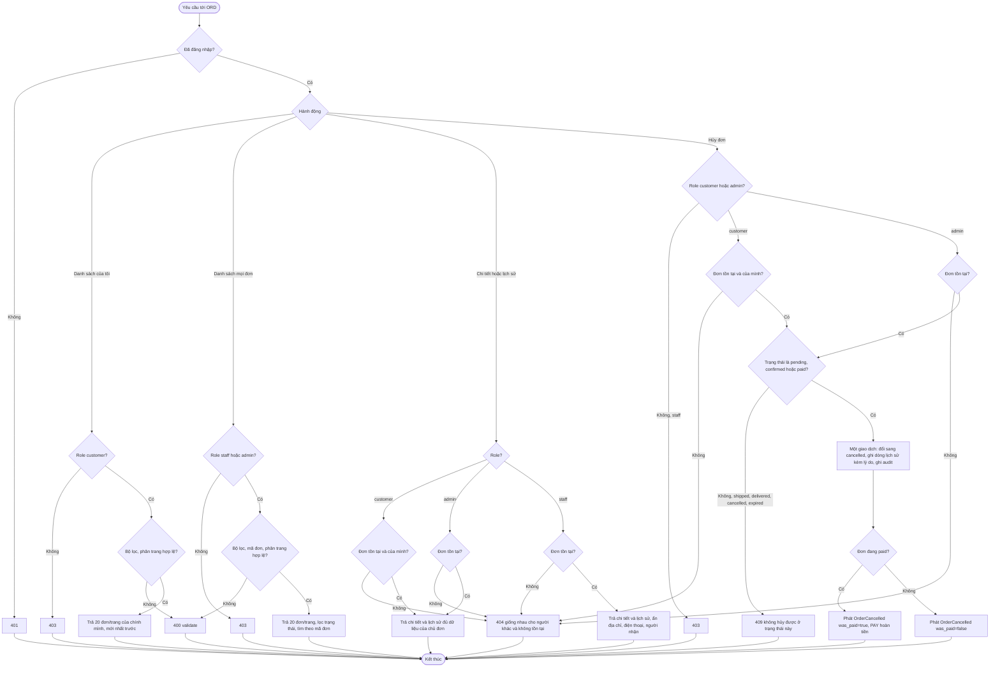
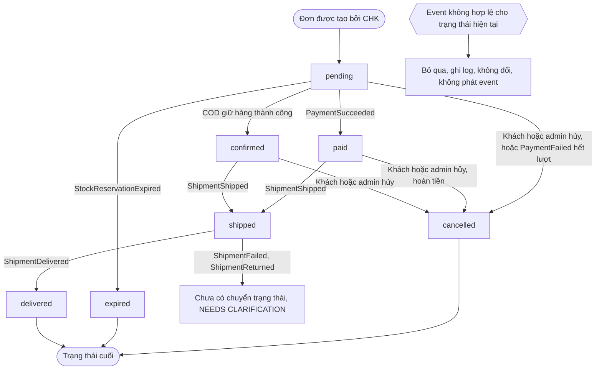

# Flow: Truy cập, hủy và vòng đời đơn hàng (ORD)

## 1. Truy cập đơn và hủy đơn (người dùng)

## 2. Vòng đời đơn theo event (tác nhân hệ thống)

## Chú thích
- Mỗi nhánh lỗi ở sơ đồ 1 (401, 403, 400, 404, 409) có Given/When/Then ở requirement tương ứng: danh sách ORD-REQ-20261006-092320716 và ORD-REQ-20261006-092320743, chi tiết ORD-REQ-20261006-092320768, lịch sử ORD-REQ-20261006-092320812, hủy ORD-REQ-20261006-092320834.
- Sơ đồ 2 ứng với ORD-REQ-20261006-092320790; mỗi lần đổi trạng thái hợp lệ ghi một dòng lịch sử (ORD-REQ-20261006-092320812) và phát một event theo `spec/domain/events.md`.
- Staff không có nhánh hủy hay đổi trạng thái; việc đánh dấu giao thuộc SHP.
- Epic khác bị chạm tới: AUTH (phiên, role), CHK (tạo đơn, COD), PAY (hoàn tiền, `payment_status`), SHP (ShipmentShipped/Delivered/Failed/Returned), INV (StockReservationExpired, nhả hàng), PRM (nhả coupon), NTF (thông báo). Chưa có requirement của các epic này.
- Chỗ lộ ra khi vẽ: chưa có đường cho ShipmentFailed/ShipmentReturned; chưa rõ ai chuyển pending -> confirmed cho COD; chưa rõ "hết lượt thử" của PaymentFailed.
