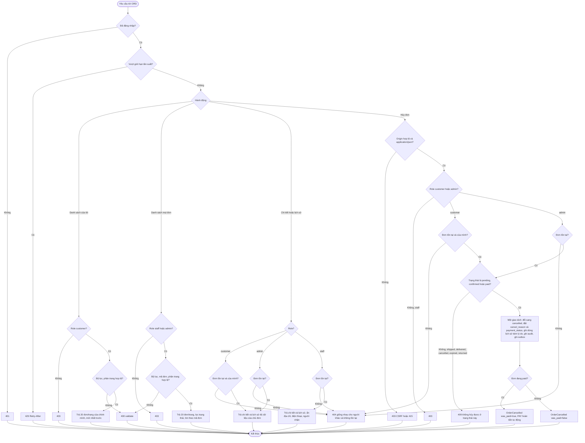
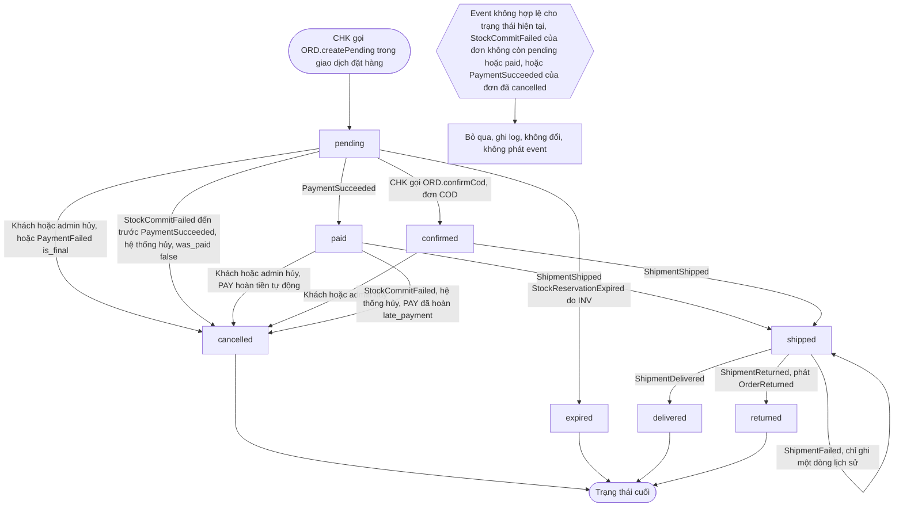
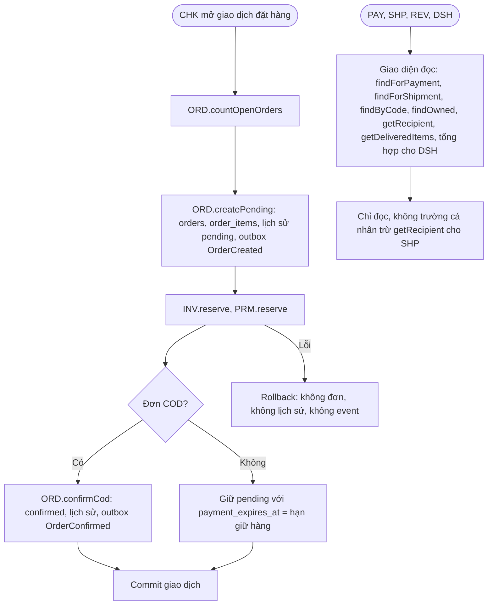

# Flow: Truy cập, hủy, vòng đời đơn hàng và giao diện nội bộ (ORD)

## 1. Truy cập đơn và hủy đơn (người dùng)

## 2. Vòng đời đơn (tác nhân hệ thống)

## 3. Giao diện nội bộ với CHK và các module đọc

## Chú thích
- Mỗi nhánh lỗi ở sơ đồ 1 (401, 429, 403, 400, 404, 409) có Given/When/Then ở requirement tương ứng: danh sách ORD-REQ-20261006-092320716 và ORD-REQ-20261006-092320743, chi tiết ORD-REQ-20261006-092320768, lịch sử ORD-REQ-20261006-092320812, hủy ORD-REQ-20261006-092320834.
- Sơ đồ 2 ứng với ORD-REQ-20261006-092320790; mỗi lần đổi trạng thái hợp lệ ghi một dòng lịch sử (ORD-REQ-20261006-092320812) và phát một event theo `spec/domain/events.md` (trừ ShipmentFailed không có event; `returned` phát OrderReturned, `pending -> cancelled` và `paid -> cancelled` do StockCommitFailed phát OrderCancelled `stock_commit_failed`; PaymentSucceeded đến sau cho đơn đã `cancelled` là no-op, PAY hoàn `late_payment`). Đồng hồ hết hạn là của INV (K-01), ORD chỉ nhận event.
- Sơ đồ 3 ứng với ORD-REQ-20261006-120227589 (CHK) và ORD-REQ-20261006-120227681 (PAY, SHP, REV, DSH).
- Staff không có nhánh hủy hay đổi trạng thái; việc đánh dấu giao thuộc SHP.
- Epic khác bị chạm tới: AUTH (phiên, role, CSRF), CHK (tạo đơn, COD), PAY (hoàn tiền tự động, `payment_status`, thu COD sau OrderDelivered, nhận OrderReturned, không hoàn lần hai khi OrderCancelled `stock_commit_failed`), SHP (ShipmentShipped, TrackingChanged, Delivered, Failed, Returned), INV (StockReservationExpired, StockCommitFailed, nhả hàng), PRM (nhả coupon), NTF (thông báo, nhận OrderReturned), REV, DSH (giao diện đọc).
