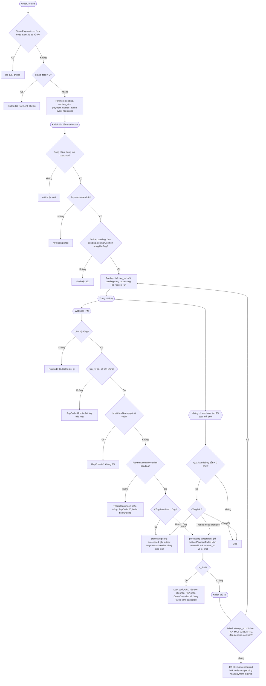
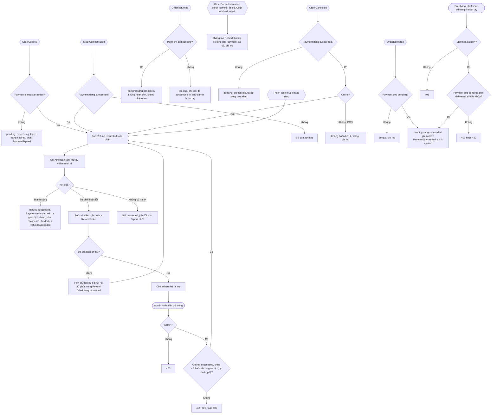

# Flow: Thanh toán online, webhook, thử lại, đóng thanh toán và hoàn tiền (PAY)

## 1. Thanh toán online: bắt đầu, webhook, thử lại

## 2. Đóng thanh toán, hoàn tiền và thu tiền COD

## Chú thích
- Mỗi nhánh lỗi có Given/When/Then: bắt đầu thanh toán PAY-REQ-20261006-103110422, webhook PAY-REQ-20261006-103110513, thành công và COD PAY-REQ-20261006-103110597, thất bại và đối soát PAY-REQ-20261006-103110684, thử lại PAY-REQ-20261006-103110771, đóng thanh toán PAY-REQ-20261006-103110858, hoàn tiền tự động PAY-REQ-20261006-103110946, hoàn tiền thủ công PAY-REQ-20261006-103111034. Tạo thanh toán là PAY-REQ-20261006-103110331. Xem lịch sử: PAY-REQ-20261006-103111122 và PAY-REQ-20261006-103111211 (chỉ đọc, không có trong sơ đồ).
- Epic khác bị chạm: ORD (OrderCreated, OrderCancelled, OrderExpired, OrderDelivered, OrderReturned vào; PaymentSucceeded, PaymentFailed, PaymentExpired, PaymentRefunded ra; giao diện đọc `findForPayment`), INV (StockCommitFailed vào; PaymentSucceeded chốt hàng; giữ đồng hồ hết hạn), PRM (PaymentSucceeded tiêu thụ coupon đơn online), NTF (PaymentSucceeded, PaymentFailed, RefundSucceeded, RefundFailed; NTF tự nhận OrderReturned), DSH (đọc số liệu qua giao diện đọc, không nhận event), CHK (chặn đơn 0 đồng và ngoài khoảng số tiền, điều hướng tới trang thanh toán, CHK-REQ-20261006-105052272). Mọi event của PAY đi qua outbox (ADR-011).
- Chỗ lộ ra khi vẽ (đã được nền xử lý 2026-10-06): vòng đời Payment đã có `failed`/`processing` sang `expired`/`cancelled` và `failed -> succeeded` (E-19); COD thu tự động bằng OrderDelivered (V-10); lượt cuối báo bằng `is_final` (V-05); event INV không chốt được hàng là StockCommitFailed (V-04); Refund `failed` thử lại bằng chính dòng đó (E-19). Đợt 2 (2026-10-06): OrderReturned báo PAY đóng Payment COD `pending` khi đơn hoàn về (M-03, R-15); OrderCancelled `stock_commit_failed` do ORD tự hủy đơn `paid` không tạo Refund lần hai (M-04, R-02); `PAY_MAX_ATTEMPTS` cấu hình và `reason` của PaymentFailed là mã (M-06).
