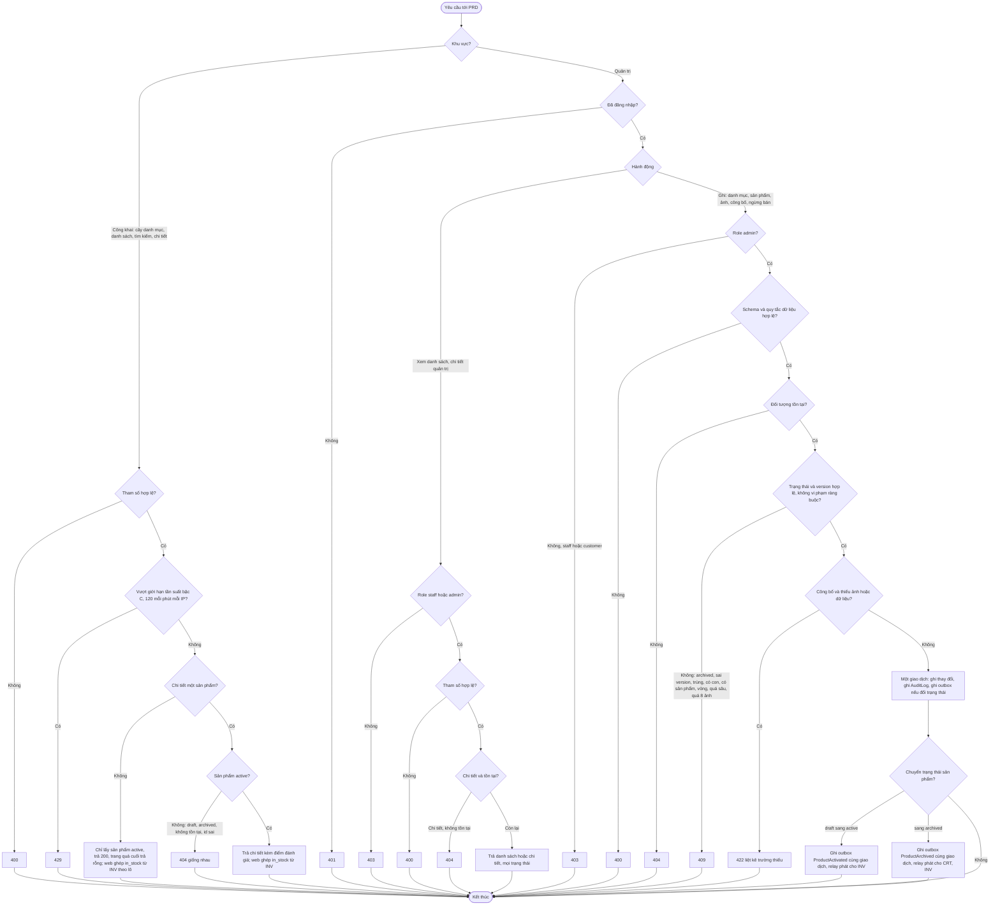
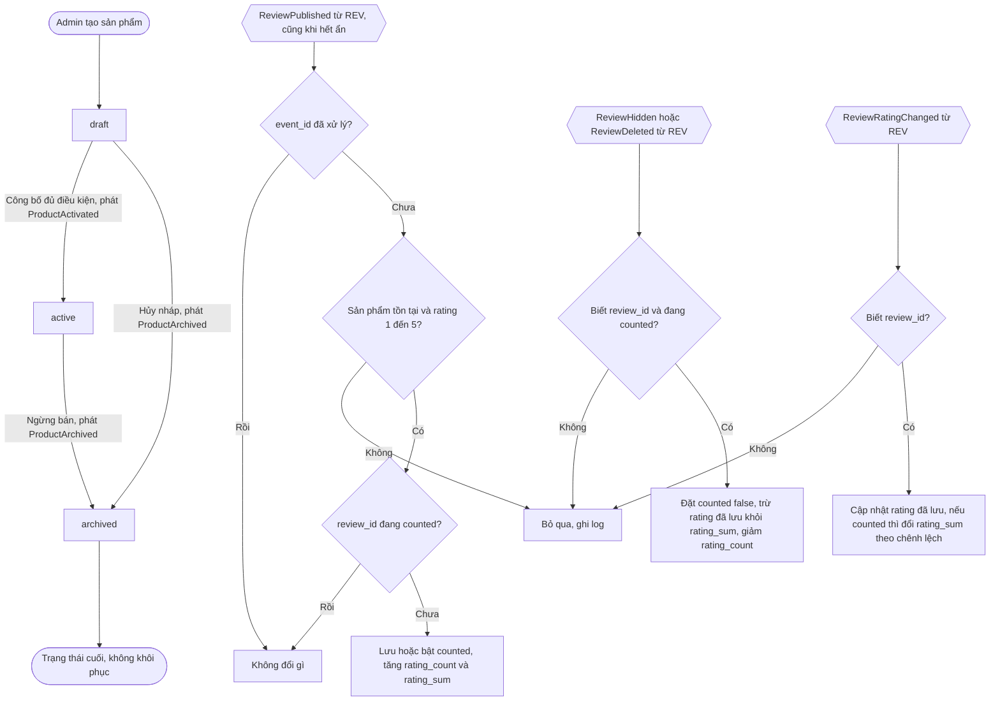

# Flow: Danh mục, sản phẩm và khám phá sản phẩm (PRD)

## 1. Yêu cầu quản trị (admin, staff) và yêu cầu công khai

## 2. Vòng đời sản phẩm và event vào PRD (tác nhân hệ thống)

## Chú thích
- Mỗi nhánh lỗi ở sơ đồ 1 có Given/When/Then ở requirement: cây danh mục PRD-REQ-20261006-095502484; tạo, sửa danh mục PRD-REQ-20261006-095502507; xóa danh mục PRD-REQ-20261006-095502529; tạo sản phẩm PRD-REQ-20261006-095502550; sửa sản phẩm PRD-REQ-20261006-095502571; ảnh PRD-REQ-20261006-095502592; công bố PRD-REQ-20261006-095502613; ngừng bán PRD-REQ-20261006-095502634; quản trị xem PRD-REQ-20261006-095502655; chi tiết công khai PRD-REQ-20261006-095502676; duyệt PRD-REQ-20261006-095502697; tìm kiếm PRD-REQ-20261006-095502718.
- Sơ đồ 2 ứng với PRD-REQ-20261006-095502739 (điểm đánh giá) và vòng đời trong `spec/domain/entities.md`. Mỗi chuyển hợp lệ của sản phẩm ghi một audit và phát đúng một event theo `spec/domain/events.md`.
- Staff chỉ có nhánh xem ở sơ đồ 1; mọi nhánh ghi là 403 với staff.
- Mọi yêu cầu công khai chỉ thấy sản phẩm `active`; 404 của chi tiết giống nhau cho draft, archived, không tồn tại và id sai định dạng.
- Epic khác bị chạm tới: INV (ProductActivated tạo bản ghi kho; ProductArchived), CRT (ProductArchived; giá), REV (ReviewPublished, ReviewHidden, ReviewDeleted, ReviewRatingChanged), CRT (giá, ProductArchived), CHK (giá, sản phẩm lúc đặt hàng, qua CRT), DSH (`countByStatus`), platform (guard, AuditLog, outbox, giới hạn tần suất; không phải phụ thuộc khai báo).
- Chỗ còn lại sau đồng bộ nền: không có event đổi giá (ProductPriceChanged là backlog v1); PRD không đọc tồn kho, web ghép `in_stock` từ INV (K-12).
