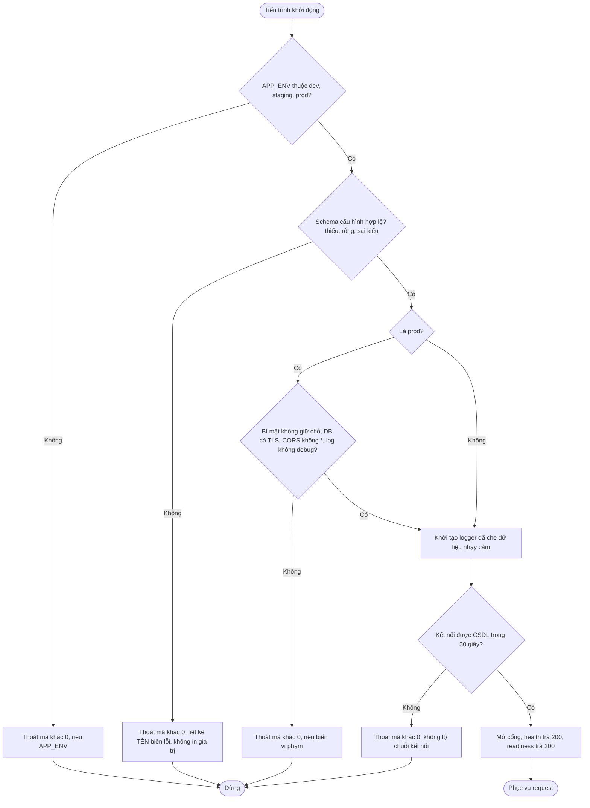
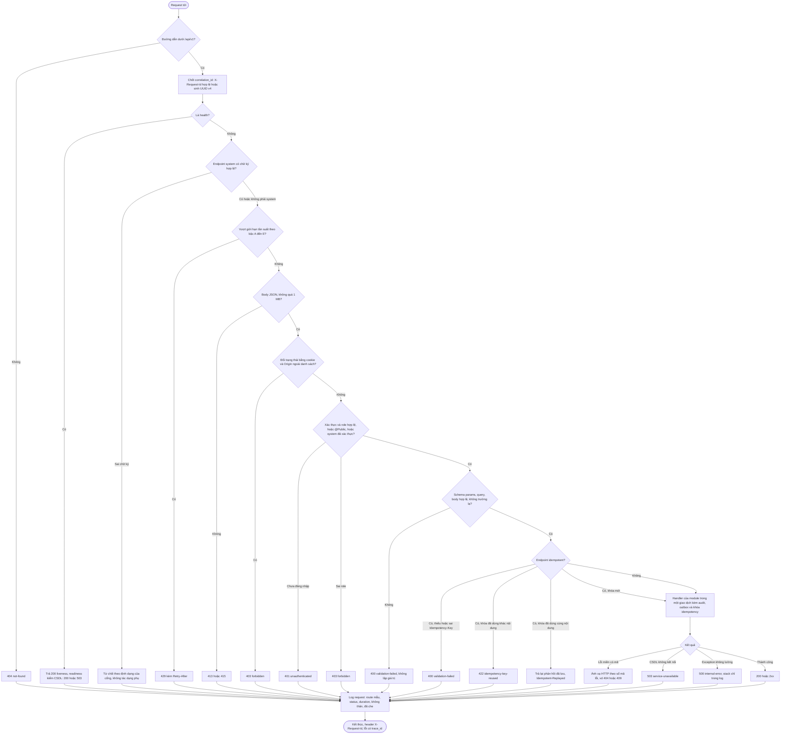
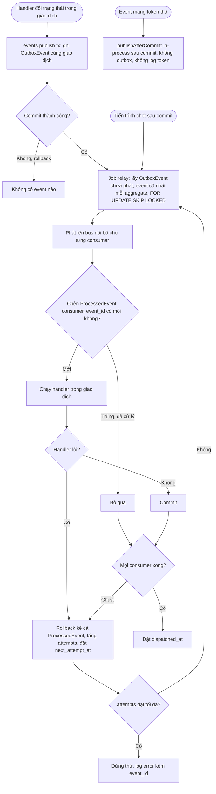

# Flow: Khởi động nền tảng, vòng đời một request và phát event bền (PRJ)

## 1. Khởi động

## 2. Vòng đời một request

## 3. Phát event bền và consumer idempotent

## Chú thích
- Nhánh lỗi của sơ đồ 1 (APP_ENV sai, cấu hình lỗi, prod vi phạm, CSDL không kết nối) có Given/When/Then ở PRJ-REQ-20261006-095422735 và PRJ-REQ-20261006-095422563.
- Nhánh lỗi của sơ đồ 2: 404, 429, 413, 415, 403 (CSRF), 401, 403, 400 thuộc PRJ-REQ-20261006-095422650 (và dạng phản hồi thuộc PRJ-REQ-20261006-095422820); 500 và 503 thuộc PRJ-REQ-20261006-095422820; log và audit thuộc PRJ-REQ-20261006-095422908. Sơ đồ 3: ghi event bền, consumer chống trùng, thử lại và ngoại lệ token thô thuộc PRJ-REQ-20261006-095422563 (BR12, BR13, BR16); `Idempotency-Key`, bậc giới hạn tần suất và `@SystemEndpoint` ở sơ đồ 2 thuộc PRJ-REQ-20261006-095422650 (BR7, BR12, BR13). Dựng dự án và CI (PRJ-REQ-20261006-095422475) không nằm trong request nên chỉ xuất hiện ở bước kiểm ranh giới trước khi khởi động.
- Thứ tự guard rồi schema rồi handler khớp thứ tự kiểm 401, 403, 400, 404, 409 ở ORD-API.
- Epic khác bị chạm: mọi epic (dùng logger, cấu hình, lỗi, giao dịch, audit); AUTH (cài đặt giao diện người dùng hiện tại); ORD (sổ mã lỗi `order-not-cancellable`, audit khi hủy).
- Chỗ lộ ra khi vẽ (đã giải quyết bởi nền mới): guard-AUTH qua `SessionContext` (ADR-012); CSRF bằng Origin (ADR-016); kho đếm PostgreSQL và bộ nhớ (ADR-014); requirement hạ tầng dùng role `system` (R-01). Còn mở: bậc D, E của giới hạn tần suất chưa gán kho đếm ở nền.
