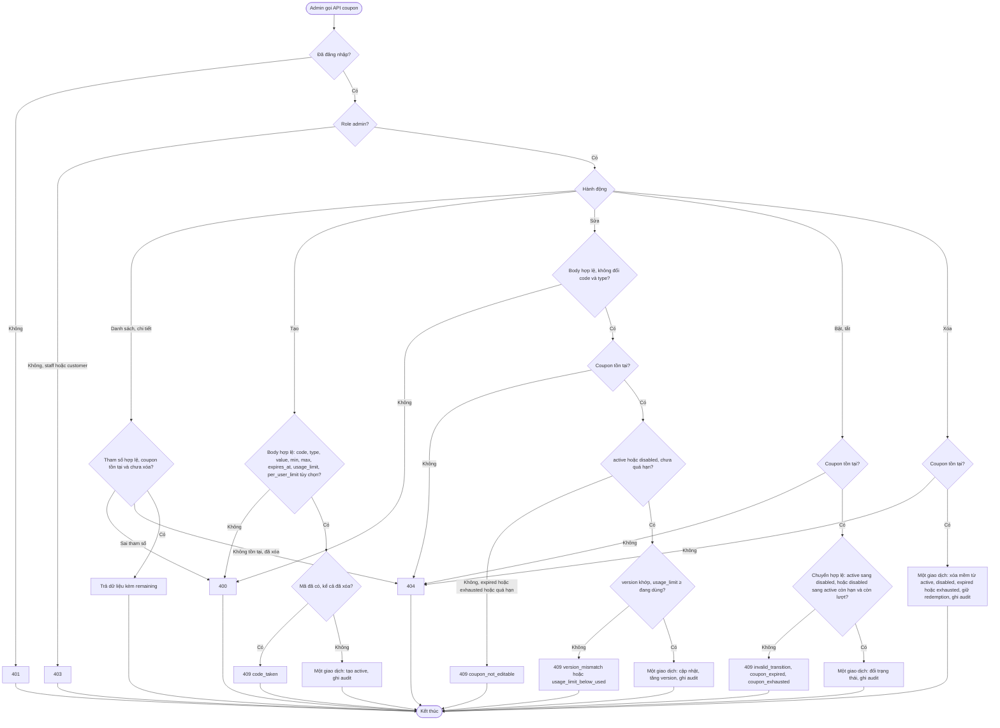
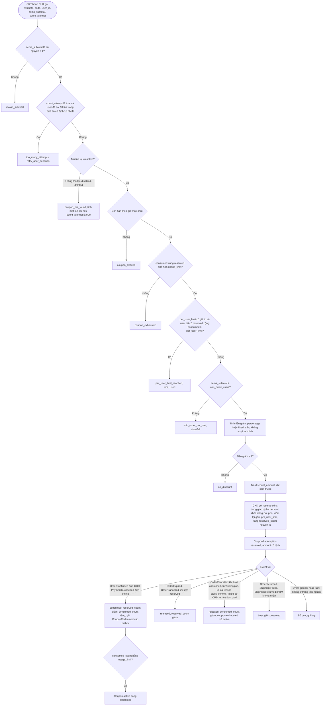
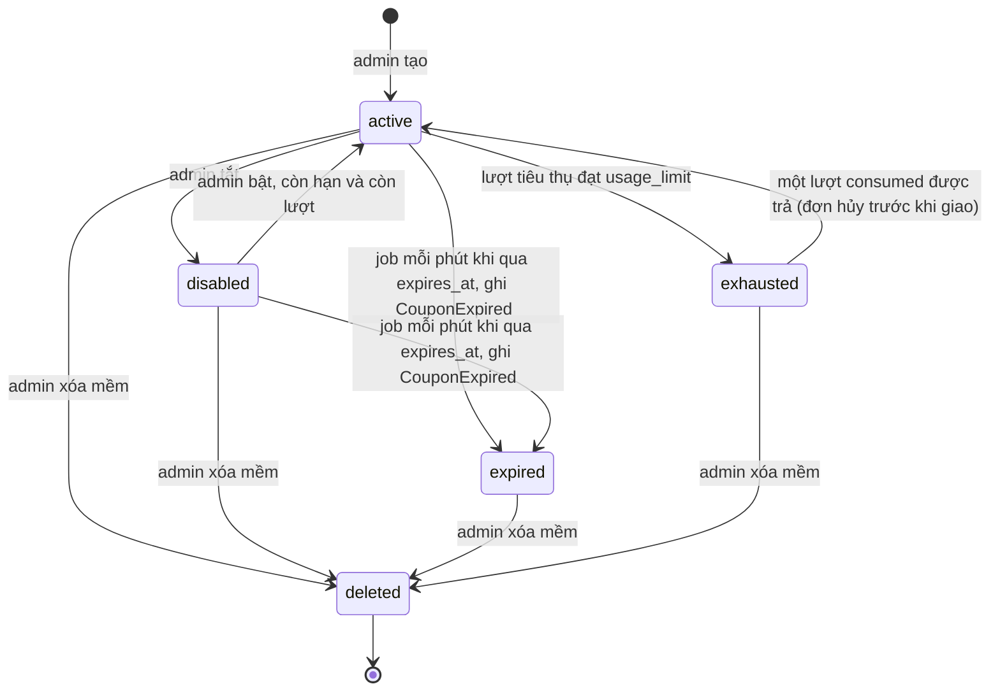

# Flow: Quản lý coupon và vòng đời lượt dùng (PRM)

## 1. Admin quản lý coupon

## 2. Khách dùng coupon: kiểm tra, giữ, tiêu thụ, nhả (qua giao diện nội bộ và event)

## 3. Vòng đời coupon

## Chú thích
- Mỗi nhánh lỗi ở sơ đồ 1 (400, 401, 403, 404, 409) có Given/When/Then ở requirement tương ứng: tạo PRM-REQ-20261006-101036201, sửa PRM-REQ-20261006-101036227, xóa PRM-REQ-20261006-101036252, bật và tắt PRM-REQ-20261006-101036275, danh sách PRM-REQ-20261006-101036299.
- Sơ đồ 2: kiểm tra mã PRM-REQ-20261006-101036327; phần trăm PRM-REQ-20261006-101036352; cố định PRM-REQ-20261006-101036376; tối thiểu PRM-REQ-20261006-101036400; hạn dùng PRM-REQ-20261006-101036424; lượt dùng PRM-REQ-20261006-101036447; giữ, tiêu thụ, nhả PRM-REQ-20261006-101036470.
- PRM không có endpoint công khai cho khách; CRT và CHK gọi giao diện nội bộ. Staff không có nhánh nào trong flow này.
- Epic khác bị chạm tới: CRT (áp mã ở giỏ, CRT-REQ-20261006-103226511), CHK (giữ lượt trong giao dịch tạo đơn, CHK-REQ-20261006-105052127), ORD (OrderConfirmed, OrderCancelled, OrderExpired), PAY (PaymentSucceeded), PRJ (audit, outbox, job nền, giới hạn tần suất), AUTH (phiên, role). Chỉ các epic đã có requirement được ghi trong `links`.
- Đồng bộ nền 2026-10-06: COD tiêu thụ ở OrderConfirmed (K-10); hủy đơn trước khi giao trả lượt kể cả đã `consumed` (E-23); coupon `expired` và `exhausted` xóa được; job chuyển cả `disabled` quá hạn sang `expired`; PRM không nhận CheckoutExpired (V-11).
- Đồng bộ nền đợt 2: thêm `per_user_limit` (M-07, R-01) vào tạo, sửa và nhánh kiểm sau `coupon_exhausted`; `reserve` có `tx` khóa dòng Coupon (M-02, R-29); OrderCancelled `stock_commit_failed` (M-04, R-02) trả lượt `consumed`; OrderReturned không tới PRM (M-03, R-15).
- Còn lại khi vẽ: tổng đơn 0 đồng (CHK, PAY).
