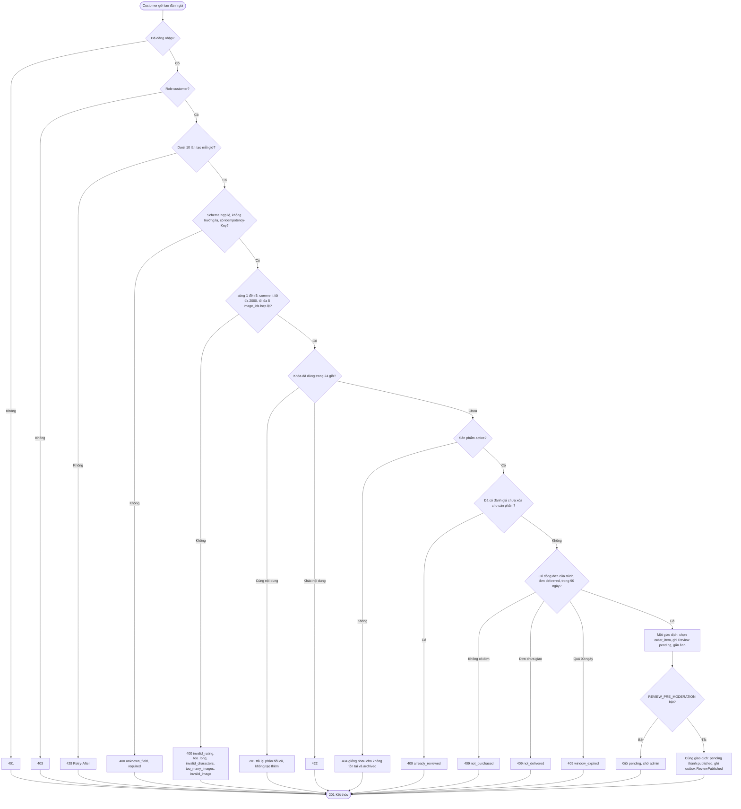
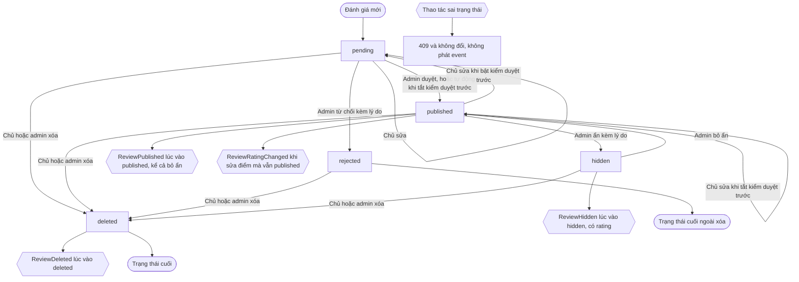
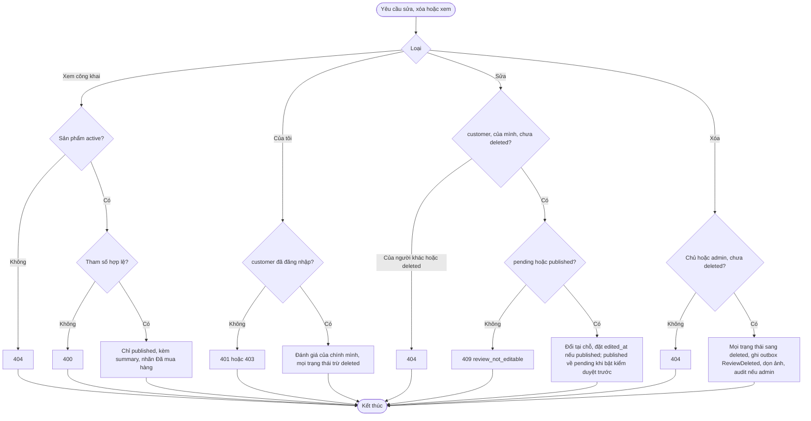

# Flow: Viết, sửa, xóa và kiểm duyệt đánh giá (REV)

## 1. Tạo đánh giá (kiểm điều kiện mua, kiểm dữ liệu, trạng thái đầu)

## 2. Vòng đời đánh giá và kiểm duyệt

Mọi event ghi vào outbox cùng giao dịch với đổi trạng thái (ADR-011); PRD giữ ProductReviewRating theo review_id để cập nhật điểm idempotent. Chuyển published sang pending chưa có event cho PRD (xem questions.md, Nền còn thiếu).

## 3. Sửa, xóa và xem (tóm tắt các nhánh lỗi)

## Chú thích
- Mỗi nhánh lỗi ở sơ đồ 1 có Given/When/Then ở REV-REQ-20261006-103134939 (tạo), REV-REQ-20261006-103135029 (điểm), REV-REQ-20261006-103135117 (chữ), REV-REQ-20261006-103135207 (ảnh), REV-REQ-20261006-103135296 (điều kiện mua). Sơ đồ 2 ứng với REV-REQ-20261006-103135835 (duyệt, từ chối, ẩn) và REV-REQ-20261006-103135744 (hàng đợi). Sơ đồ 3: sửa REV-REQ-20261006-103135385, xóa REV-REQ-20261006-103135477, xem công khai REV-REQ-20261006-103135566, của tôi REV-REQ-20261006-103135655.
- Epic khác bị chạm: ORD (`getDeliveredItems`, `delivered_at`), PRD (trạng thái sản phẩm; nhận ReviewPublished, ReviewHidden, ReviewDeleted, ReviewRatingChanged để cập nhật điểm), AUTH (phiên, role, tên hiển thị), PRJ (platform: audit, giới hạn tần suất, Idempotency-Key, outbox, kho ảnh, job nền). USR (ảnh đại diện).
- Đồng bộ nền 2026-10-06: vòng đời theo E-22 (xóa ở mọi trạng thái, bỏ ẩn, `published -> pending` khi bật kiểm duyệt trước, `rejected` cuối); event theo V-12 và K-11. Còn thiếu: event cho `published -> pending` (xem questions.md).
