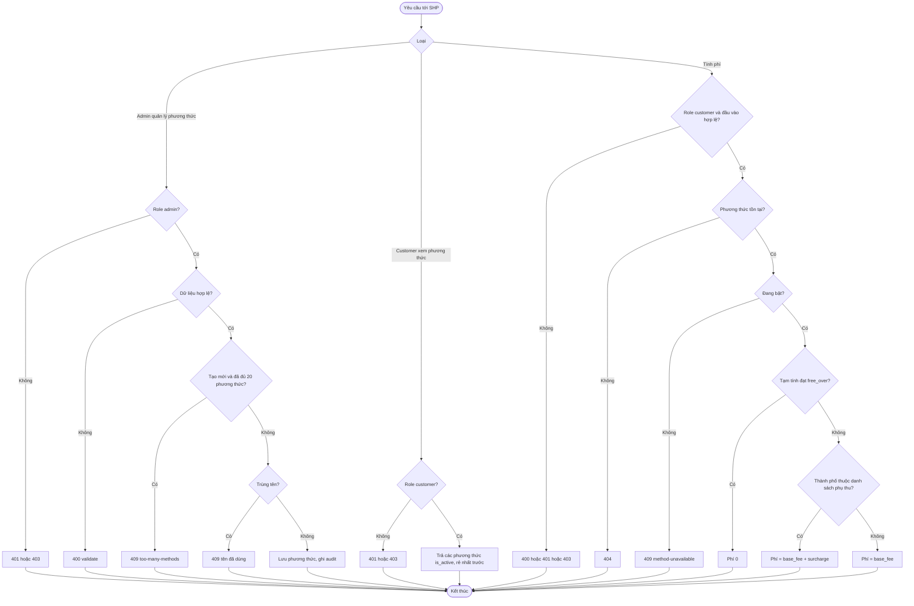
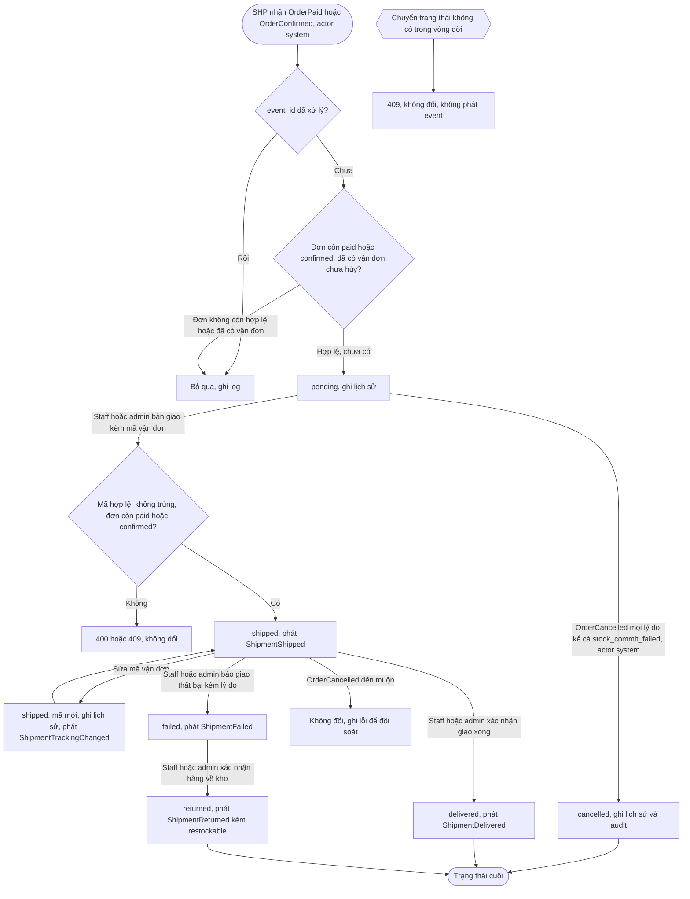
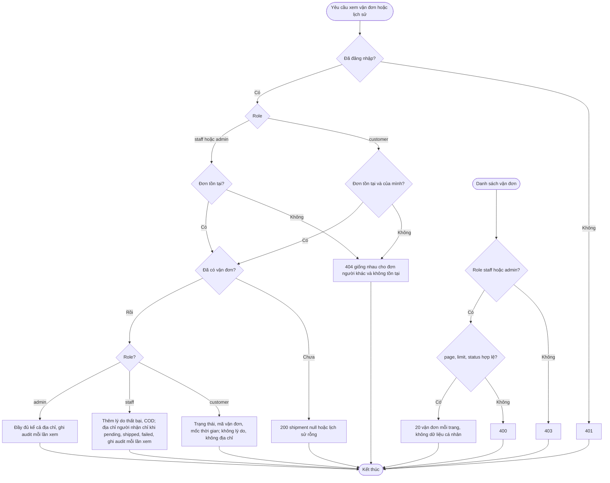

# Flow: Phương thức, phí và vòng đời vận đơn (SHP)

## 1. Phương thức vận chuyển và phí (admin cấu hình, customer xem, CRT/CHK gọi)

## 2. Vòng đời vận đơn theo event và thao tác của nhân viên

## 3. Xem vận đơn và lịch sử

## Chú thích
- Mỗi nhánh lỗi ở sơ đồ 1 (400, 401, 403, 404, 409) có Given/When/Then ở SHP-REQ-20261006-101103755 (quản lý), SHP-REQ-20261006-101103782 (danh sách), SHP-REQ-20261006-101103806 (phí).
- Sơ đồ 2 (mọi event phát ra ghi vào outbox cùng giao dịch, ADR-011; consumer chống trùng theo `event_id`): tạo vận đơn ở SHP-REQ-20261006-101103829; bàn giao ở SHP-REQ-20261006-101103855; sửa mã ở SHP-REQ-20261006-101103880; giao xong, thất bại, hoàn hàng ở SHP-REQ-20261006-101103903; hủy theo OrderCancelled ở SHP-REQ-20261006-101103950. Mỗi lần đổi trạng thái hợp lệ ghi một dòng lịch sử (SHP-REQ-20261006-101103972) và phát một event theo `spec/domain/events.md`, riêng cancelled không có event (ShipmentCancelled chỉ ở backlog của events.md); sửa mã vận đơn phát ShipmentTrackingChanged (không đổi trạng thái).
- Sơ đồ 3 ứng với SHP-REQ-20261006-101103927 (xem trạng thái) và SHP-REQ-20261006-101103972 (lịch sử).
- Epic khác bị chạm tới: ORD (nhận ShipmentShipped, ShipmentTrackingChanged, ShipmentDelivered, ShipmentFailed, ShipmentReturned; SHP đọc đơn qua giao diện đọc của ORD), CHK và CRT (gọi `listActiveMethods`, `quote`), PAY (COD thu tiền khi nhận OrderDelivered của ORD, V-10), INV (ShipmentReturned: StockMovement `return` khi `restockable` = true, không đổi kho khi false, R-11), NTF (ShipmentFailed; OrderReturned của ORD). ShipmentReturned đưa đơn `shipped -> returned` ở ORD, ORD phát OrderReturned cho PAY (đóng Payment COD `pending`) và NTF (M-03, R-15); SHP không nhận OrderReturned.
- Đã giải quyết bằng nền mới: đơn thu tiền xong rồi giao thất bại: Order giữ `shipped`, hoàn về thì `shipped -> returned` và admin hoàn tiền thủ công (K-03); sửa mã vận đơn có event (V-09); OrderPaid, OrderConfirmed không mang phương thức vận chuyển, SHP đọc `Order.shipping_method_id` qua `ORD.findForShipment` (E-12). Còn chỗ lộ ra: chưa có đường giao lại sau `failed` (E-24, để SAU).
