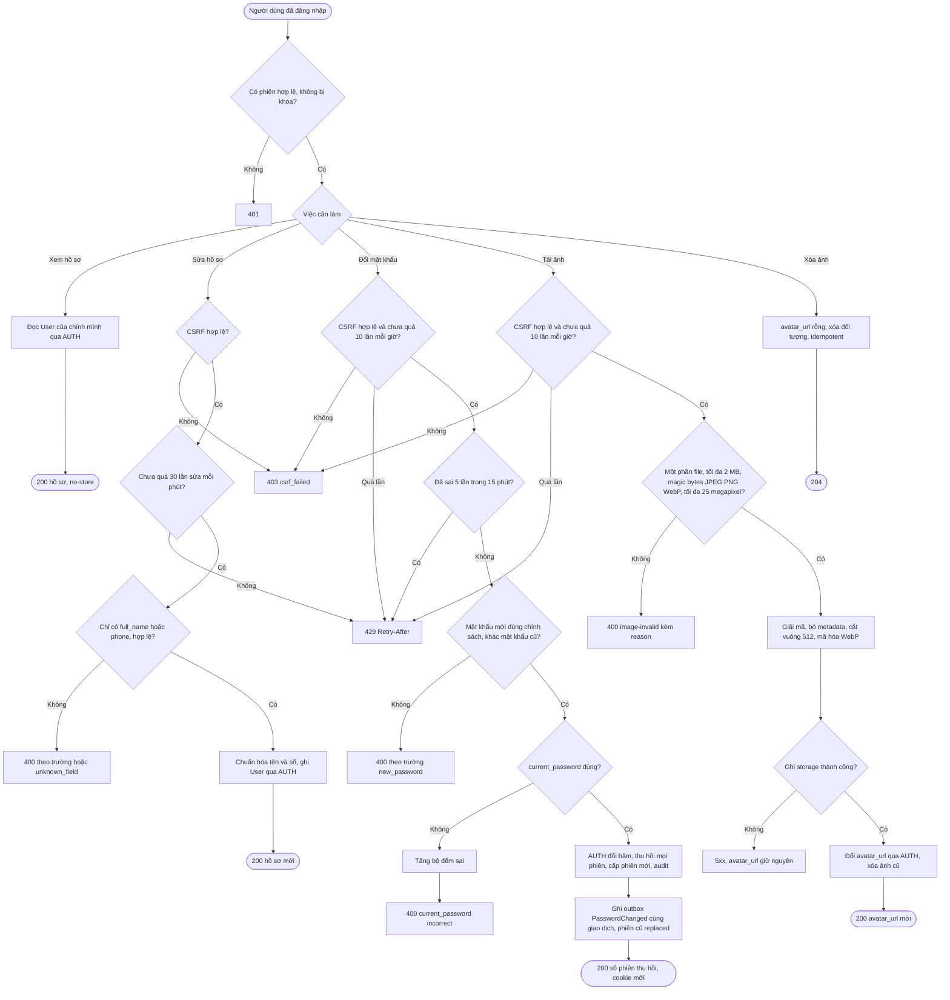
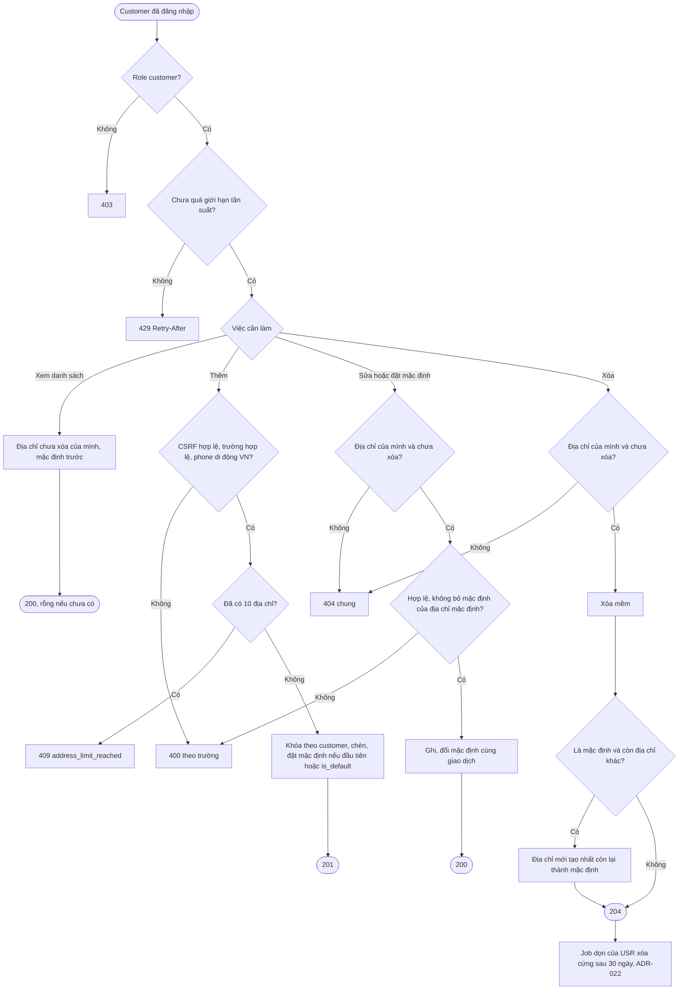
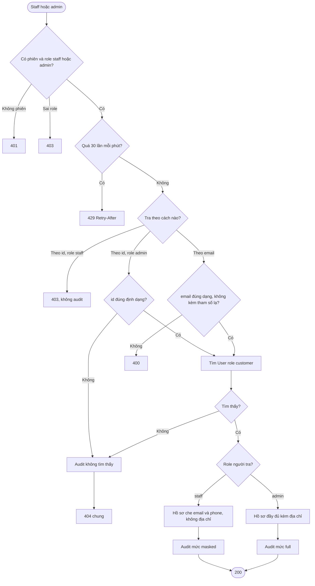

# Flow: Hồ sơ, mật khẩu, ảnh đại diện, sổ địa chỉ và tra cứu khách (USR)

## 1. Hồ sơ, đổi mật khẩu, ảnh đại diện

## 2. Sổ địa chỉ của customer

## 3. Tra cứu khách của staff và admin

## Chú thích
- Mỗi nhánh lỗi trong sơ đồ có Given/When/Then ở requirement tương ứng: 401, 403, 404, 409, 429 và 400 theo trường.
- Epic khác bị chạm: AUTH (User, thu hồi phiên, PasswordChanged qua outbox), NTF (email báo đổi mật khẩu, nhận event của AUTH), PRJ (giới hạn tần suất, audit, log che dữ liệu, cấu hình storage; nền tảng dùng chung, không khai phụ thuộc), CHK (đọc địa chỉ qua giao diện nội bộ), ORD (bản chụp địa chỉ của đơn; staff không thấy người nhận nên chỉ tra khách bằng email).
- Giới hạn tần suất (SB-14): đổi mật khẩu bậc A; tải ảnh bậc B; tra cứu khách bậc D (kho đếm PostgreSQL, M-09; audit một dòng mỗi lần, lỗi audit thì 500, M-10); các endpoint ghi còn lại của USR bậc B, đọc của chính mình 120 mỗi phút (mặc định của USR).
